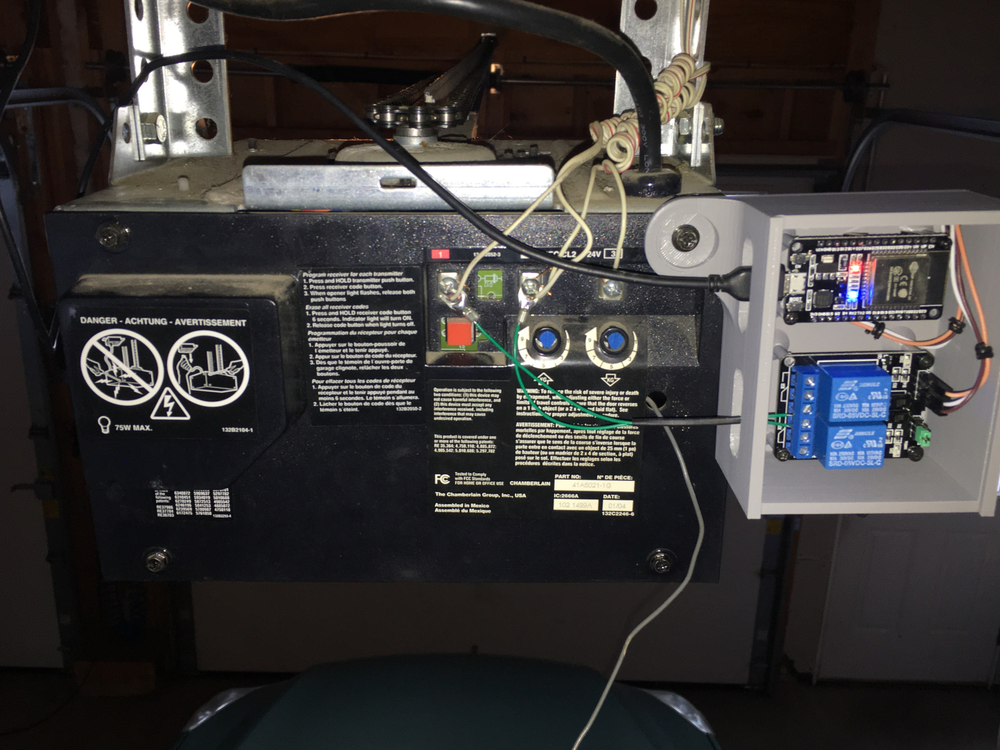
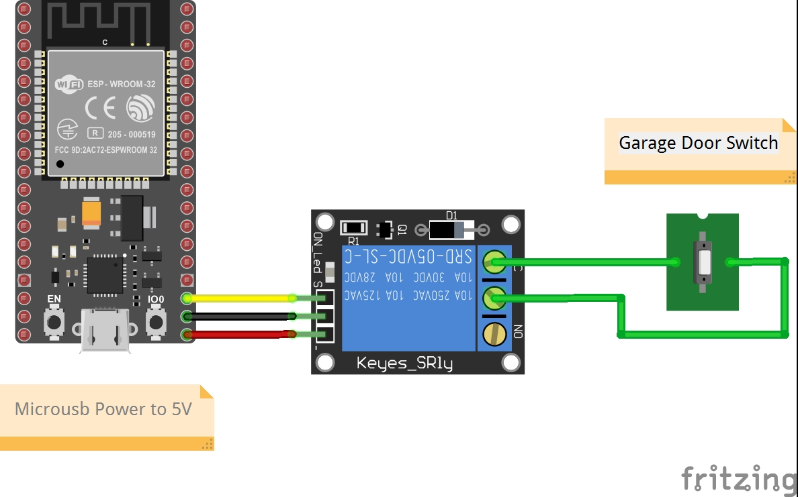

# esp32-garage-door-opener

esp32 IoT device to open/close your garage door with Apple HomeKit



## Software

This device can be controlled completely independent of any smart-home infastructure. It's simply an IoT "thing" you send HTTP GET requests to open/close your garage door.

That said, I personally am integrating this with Apple HomeKit. In order to do this you'll need a local instance of [Homebridge](https://homebridge.io/). You'll also need to install the [homebridge-http-garage](https://github.com/phenotypic/homebridge-http-garage) plugin for homebridge.

Once connected to your network, set a DHCP reservation so the device retains it's IP address. Then you can control it by sending HTTP requests to the routes below:

### Routes

The `/` endpoint is purely informational. It's helpful when setting up the garage door the first time.
```
/
```

The `/toggle` endpoint toggles the garage door. It's equivelant to you pushing the garage door button.

```
/toggle
```

The `status` endpoint will return json indicating the state of the garage door. `{"currentState":0}`
```
/status
```

The `setState` route accepts a query param called `value`. You can set state to `0` (open) or `1` (closed).
```
/setState?value=INT_VALUE
```

### Homebridge Configuration

I recommend following the default homebridge configuration suggested by the [homebridge-http-garage](https://github.com/phenotypic/homebridge-http-garage) plugin readme. Here's what I use:

```json
{
    "accessory": "GarageDoorOpener",
    "name": "Garage Door",
    "apiroute": "http://192.168.1.35",
    "openTime": 13,
    "closeTime": 13,
    "autoLock": false,
    "autoLockDelay": 20,
    "pollInterval": 120,
    "timeout": 2000,
    "http_method": "GET"
}
```

## Hardware

The hardware is an ESP32 microcontroller with a relay module. The rear of the garage door unit has three screw terminals connected to the wall switch.

The relay is connected between the two screw terminals connected to the garage door opener push-button. When the relay is closed the garage door unit recognizes this as a "button press" and opens/closes the door as if you pushed the button on the wall.

From the ESP32, I'm driving the relay board with `3.3V` and `GND` and using `D15` as the control pin set HIGH or LOW to control the relay. 

## Installation

Wire microcontroller to relay, and relay to garagedoor as shown.



| ESP32 | Relay | Garage Door |
|:-----:|:-----:|:-----------:|
|  3.3V |  VCC  |             |
|  GND  |  GND  |             |
|  D15  |   IN  |             |
|       |   NC  |   Switch 1  |
|       |   C   |   Switch 2  |

## Troubleshooting

*Does your sensor work initially, then become unresponsive?*

I had this issue after setting up my Homekit Hub (Apple TV). The sensor would become unresponsibe and require a restart ever couple hours. I found this was caused by the ESP32 WebServer library's default socket timeout. 

The HomeKit hub constantly polls the device to check it's status. Every time it does this, the HomeKit Hub (client) opens a socket connection to your device to request data. The WebServer will maintain that connection until the client closes the connection OR the connection times out. 

For some reason the sockets are not being closed and hang around until they timeout. Since the default timeout is long (2 seconds) all of these connections are being created faster then they're timing out and piling up until the server becomes unresponsive.

Here's how I fixed it. Find the `WebServer.h` header file. Located here on my computer.

```
C:\Users\<username>\AppData\Local\Arduino15\packages\esp32\hardware\esp32\2.0.2\libraries\WebServer\src\WebServer.h
```

Look for the line defining the `HTTP_MAX_CLOSE_WAIT` variable and change the default from `2000` to `100`.

```cpp
#define HTTP_MAX_CLOSE_WAIT 100 //ms to wait for the client to close the connection
```

Recompile and flash your firmware.
